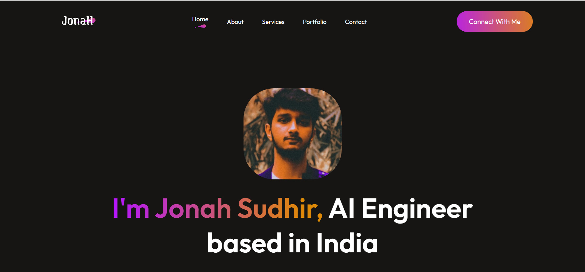

# 🌐 Professional-Portfolio-3

A modern and responsive **personal portfolio website** built with **React**.
It showcases professional skills, services, and projects in a clean and minimal design.

---

## 📸 Preview


---

## 🚀 Features
- 🎨 Responsive design optimized for all screen sizes  
- 🧩 Modular React components for scalability  
- 🔗 Smooth scroll navigation with `react-anchor-link-smooth-scroll` 
- 🛠️ Services, About, and Contact sections  
- 📄 Downloadable resume button  
- 🌍 Easy to deploy on **Vercel**, **Netlify**, or GitHub Pages  

---

## 🛠️ Tech Stack
- **React.js** – frontend library
- **JavaScript**  
- **React Anchor Link Smooth Scroll** – smooth section navigation  

---

## 📂 Project Structure
```bash
Professional-Portfolio-3/
│
├── public/               # Static files (favicon, images, etc.)
├── src/
│   ├── assets/           # Images, icons, and SVGs
│   ├── components/       # Reusable UI components
│   │   ├── Hero/         
│   │   ├── Services/
│   │   ├── About/
│   │   └── Contact/
│   ├── App.js            # Main app file
│   ├── index.js          # Entry point
│
├── package.json
├── tailwind.config.js
├── README.md
└──
```

---

## 👨‍💻 Author
Jonah Sudhir
AI/ML Engineer | Full-Stack Developer
📍 India
